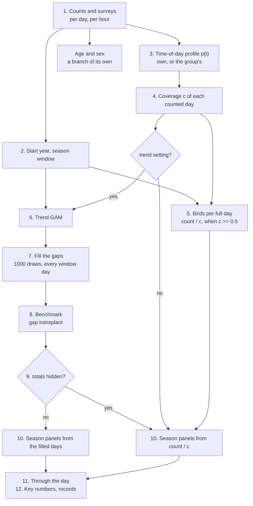

# defile-explore

The statistics behind the **Explore** page of [defileViz](https://github.com/Rafnuss/defileViz):
long-term trends, phenology, time of day and the other per-species views of the bird migration
counted at Défilé de l'Écluse (France) since 1966.

It reads the release of the **defile-dataset** (survey and count tables) and writes one JSON file
per taxon, which defileViz renders. The data are counts, and the page shows them as counts first:
model output (a GAM trend, gap-filled totals, smooth phenology) is drawn on top, never instead.

Sister repos:

- **defile-dataset**: the counts, their corrections and documentation (the input here).
- **defile-migration-forecast**: the daily migration forecast (deep learning on weather). Fully
  independent of this repo; see `DECISIONS.md` -> Repository.
- **defileViz**: the website (Vue), which shows both.

## Setup

[uv](https://docs.astral.sh/uv/) with Python 3.11; versions are pinned in `pyproject.toml` and
locked in `uv.lock`.

```bash
uv sync
uv run pytest
```

## Build the export

The release comes from defile-dataset, so rebuild it there first (`uv run python scripts/build_dataset.py`): `--dataset` copies whatever is in its `output/` at that moment, and
the build is only as current as that copy. A release without `parent_taxon_id` in `taxonomy.csv`
is refused.

```bash
# copy a defile-dataset release into data/count/dataset/, then build data/explore/
uv run python scripts/build_explore.py --dataset ../defile-dataset/output > logs/build.log 2>&1

# rebuild from the copied release (cached: seconds when only a block changed)
uv run python scripts/build_explore.py > logs/build.log 2>&1
uv run python scripts/build_explore.py --taxa "Red Kite" "Hen Harrier"   # only these taxa

# QA viewer: logs/viewer/index.html, every full-tier taxon with all its model output
uv run python scripts/explore_viewer.py
# species compared (trend, passage dates, their shift), also written by the viewer
uv run python scripts/species_compare.py
```

## Publish

The build runs here, not in CI (30-40 minutes on a GitHub runner); CI only runs the tests. After a
full build and the viewer, from committed code in both repos (pushed here):

```bash
uv run python scripts/publish_explore.py --dry-run   # the checks and the zips only
uv run python scripts/publish_explore.py
```

It uploads `explore.zip` (the export) and `viewer.zip` (the viewer and the species comparison) to
the rolling `dev` pre-release of this repo, replacing the previous ones, and starts
`.github/workflows/pages.yml`, which deploys the viewer to GitHub Pages. defileViz downloads
`explore.zip` from that release when it deploys. It refuses an export built from uncommitted code
here or in defile-dataset (the manifest says so), from another commit than HEAD, from a `--taxa`
build, or with an older viewer. A versioned release later is `--tag`.

Time, on a 12-core Mac (all cores, `--workers` to change): a build after a new release or a
code change in the model takes about 5.5 minutes (the shared stage of time-of-day profiles,
about 2.5 minutes, then the 96 trend fits and their benchmark in parallel); one with nothing
changed takes about 15 seconds, and a change to a block downstream of the trend refits nothing
(`data/cache/`, `--no-cache` to ignore it). The build is verbose (pygam warnings, per-taxon
progress): redirect it to `logs/` and grep, as above; the summary at the end gives the tiers,
trends and stories. A build that stops silently with no traceback was killed from outside
(a second build started on the same folder, or a closed terminal): run it again.

`data/` and `logs/` are generated and never committed.

## Group taxa are read as everything below them

defile-dataset gives each taxon a `parent_taxon_id` (`taxonomy/parent_taxa.csv` there: a species
points to its smallest enclosing "sp." or slash taxon, a subspecies to its species). A taxon with
taxa below it is exported as the sum of its own birds and everything below it, at any depth, and
lists them in `members` (`export.add_rollups`): "harrier sp." is all harriers, "swallow sp." all
swallows and martins, a species its subspecies. Its trend, profile and start year are those of the
sum. A group (not a species) is left out (tier `excluded`, no page, its own series untouched) when
it is alone (fewer than `ROLLUP_MIN_BELOW` taxa below it), too large (more than
`ROLLUP_MAX_BELOW`: "bird sp.", "passerine sp.") or when one taxon is more than
`ROLLUP_MAX_SHARE` of its birds. `DECISIONS.md` has the reasoning; a wrong parent is fixed in
defile-dataset, not here.

## How a species file is made

`pipeline.build_taxon`, in order. Each species gets **one correction** of its counts: the trend
GAM's gap-filled days when it has a trend whose totals pass the test, otherwise birds per full day
(count / c). The two never stack.



| #   | Step                                                                                           | Module                 | For                          |
| --- | ---------------------------------------------------------------------------------------------- | ---------------------- | ---------------------------- |
| 1   | Read the counts and the surveys (who counted when), per day and per hour                       | `release`, `export`    | all                          |
| 2   | Start year (counted in full from) and season window (widened if still passing at its edges)    | `settings`, `window`   | all                          |
| 3   | Time-of-day profile p(t): a GAM over date and civil dawn-to-dusk time, on the hourly counts    | `profile`              | all (group's if few timed)   |
| 4   | Coverage c: each counted day's share of p(t) in the minutes counted                            | `profile`              | all                          |
| 5   | Birds per full day, count / c (only when c >= 0.5); also used to choose the window (2)         | `profile`, `season`    | all; on the page only via 10 |
| 6   | Trend GAM: trend, year levels, season, timing shift, episodes; count ~ c x exp(...)            | `trend`                | with a trend (74 of 275)     |
| 7   | Gap filling: 1000 draws of the birds missed, every window day gets a full-day value            | `trend`                | with a trend                 |
| 8   | Benchmark: recent seasons given older seasons' gaps, refilled, compared with what was counted  | `benchmark`            | with a trend                 |
| 9   | Reliability: totals, trend and season each `show`, `caveat` or `hide`                          | `reliability`          | with a trend                 |
| 10  | Season panels, passage dates, chances: from 7, or from 5 without a trend or with totals hidden | `season`               | all (one source per species) |
| 11  | Through the day: hours counted against the profile's prediction, over the main passage         | `daytime`              | all                          |
| 12  | Key numbers, records, accounts                                                                 | `pipeline`, `accounts` | all                          |
| -   | Age and sex: shares among the birds classed                                                    | `demography`           | where enough birds classed   |

defileViz's "How it's made" pages follow the same order: the counts (1-2), time of day and
coverage (3-5), the trend model (6-7), how reliable (8-9), what the page shows (10-12), age and
sex.

The viewer is for inspecting the model output in full detail: fits, intervals, windows, diagnostics,
method versions. What visitors see is built in defileViz, from the same species files but trimmed
and told as a story; a choice of what to show or hide (as the trend reliability classes) is defined
here, in the export, and only applied there: the viewer still draws everything, and flags on each page and
figure what defileViz will caveat or hide.

## Species and year accounts

The written accounts, in French and English, are authored in `content/accounts/` (its
[README](content/accounts/README.md) has the editorial rules): `species-sections.tsv` (a general
account per taxon) and `year-accounts.tsv` (a short account of each season). The build reads these
two files into each species file's `accounts` block; it no longer reads the report and paper
extracts of the release, which stay the editors' sources. `reading/` holds Markdown reading copies
and `review/` the editorial ledgers, both regenerated by:

```bash
uv run python scripts/accounts/check_website_account_totals.py
uv run python scripts/accounts/build_website_accounts.py
```

## Layout

```
src/defile_explore/
  release.py     reading the release tables
  export.py      raw aggregation: daily totals, effort, taxa -> JSON
  timeofday.py   the time-of-day GAM
  profile.py     effort adjustment: time-of-day profile, coverage, annual index
  trend.py       the trend GAM: smooth trend, season, timing shift, gap-filled totals
  pipeline.py    the build: a cached shared stage, then build_taxon (all blocks of one taxon)
  settings.py    per-taxon settings by rule; overrides.yaml holds the exceptions, with reasons
  season.py      the season day by day (gap-filled by the trend, else from the counts)
  daytime.py     passage through the day, as counted
  demography.py  age and sex
  window.py      each taxon's model and view windows
  accounts.py    the written accounts (content/accounts/), checked and cut per taxon
  remarks.py     what the counters and reports wrote about a day (record days)
  benchmark.py   each trend tested on its own data: gap transplant, recent seasons
  reliability.py show / caveat / hide per trend claim, for defileViz to filter on
content/accounts/  the authored accounts (two TSVs), reading copies and editorial review
scripts/
  build_explore.py           the export
  explore_viewer.py          QA viewer of the export (HTML, Plotly)
  benchmark_trend.py         the benchmark with the season-only model beside the GAM (CSV)
  analyse_explore_effort.py  comparison of effort normalisations (PDF)
  analyse_time_basis.py      held-out test of the time-of-day profile's time axis (CSV)
  analyse_gap_fill.py        held-out test of gap filling: trend GAM against interpolation (CSV)
  check_entries.py           entries that look like recording errors, for the editors (CSV)
  accounts/                  editorial exports and checks of content/accounts/
tests/
```

`DECISIONS.md` records what was decided and why, `DEVELOPMENT.md` what is still open.

## License

Code: [MIT](LICENSE). The counts belong to the defile-dataset release, which has its own terms.
